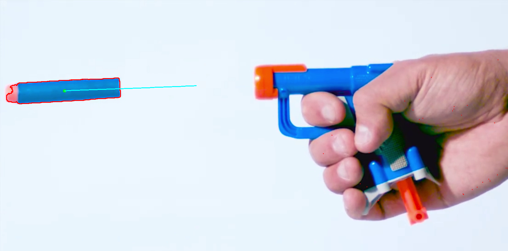

# Motion

Motion is a collection of scripts meant to track motion of an object through time. 
I watched a robotics seminar earlier today by Shuran Song from Columbia. The talk was mainly about using vision to handle non-rigid objects like ropes and cloth. During the talk, there was several displays of the path of a rope being tracked by some algorithm. I wanted to mimic that out of curiosity.

## Methods
Im investigating using the Lucas-Kanade algorithm, and the Gunnar Farneback algorithm. Overall, for my purpose, I have only had success tracking a certain contour, which is selected every frame with pre-determined rules.